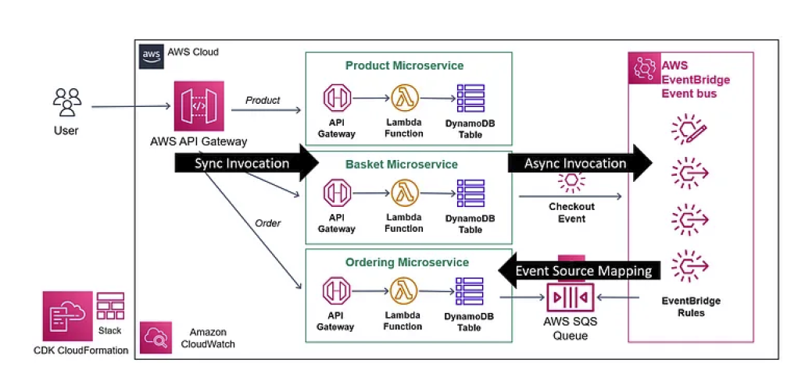

# Ecommerce Serverless Microservice

## Overview
This repository contains the source code for an ecommerce serverless microservice, designed following best practices as taught in the Udemy course ["AWS Serverless Microservices with Patterns & Best Practices"](https://www.udemy.com/course/aws-serverless-microservices-lambda-eventbridge-sqs-apigateway/). It demonstrates a robust, scalable, and cost-effective architecture using AWS services.

## Architecture
The microservice architecture leverages AWS Lambda, DynamoDB, API Gateway, EventBridge, and SQS to create a highly decoupled, event-driven system. This setup ensures efficient handling of ecommerce operations like product management, basket handling, and order processing.

## Architecture Diagram([AWS Serverless Microservices with Patterns & Best Practices](https://www.udemy.com/course/aws-serverless-microservices-lambda-eventbridge-sqs-apigateway/))
Below is the architecture diagram for the E-commerce Serverless Microservice:

### Key Components:
- **AWS Lambda**: Manages the business logic in a serverless manner.
- **DynamoDB**: NoSQL database for data persistence.
- **API Gateway**: Handles RESTful API requests and routes them to the appropriate Lambda functions.
- **EventBridge**: Orchestrates event-driven communication between microservices.
- **SQS**: Manages message queues for asynchronous processing.

## Features
- REST API with CRUD operations for product and basket management.
- Event-driven architecture for decoupling microservices.
- Asynchronous communication using AWS EventBridge and SQS.
- Infrastructure as Code (IaC) using AWS CloudFormation CDK.
- Implementation of serverless design patterns and best practices.

## Getting Started
### Prerequisites
- Basic knowledge of cloud computing and AWS.
- Familiarity with JavaScript.

### Installation and Deployment
1. Clone the repository.
2. Set up the AWS environment with the necessary permissions.
3. Deploy the services using AWS CDK.

## Contributing
Contributions are welcome. Please read the contributing guide for more information.

## License
This project is licensed under the MIT License - see the LICENSE file for details.
